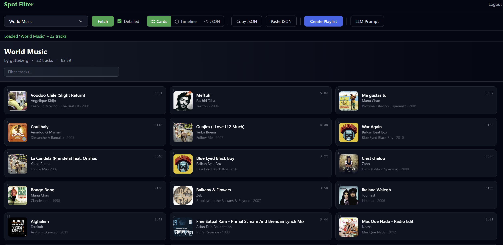
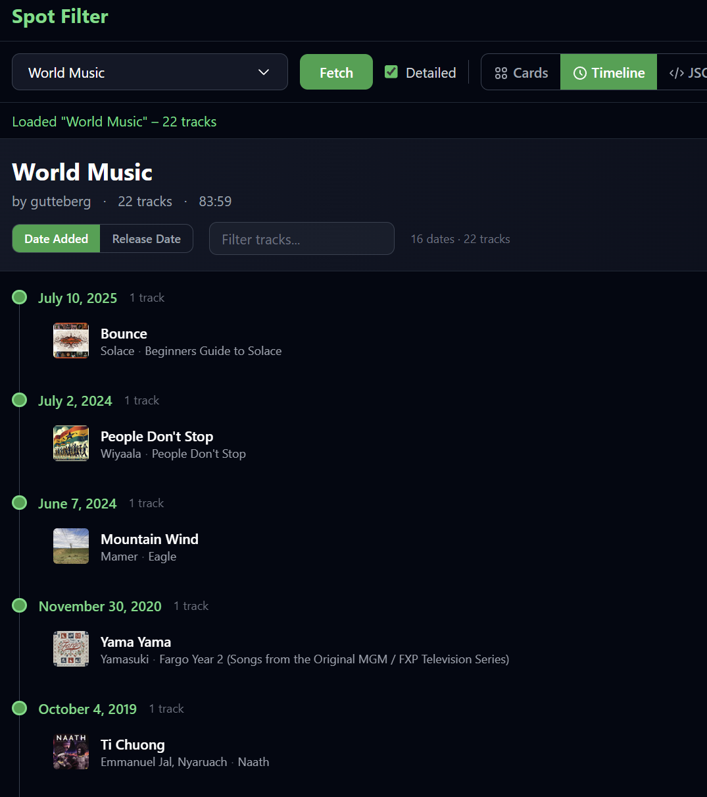
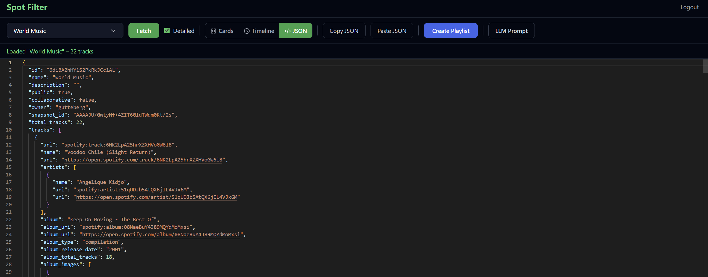

# Spot Filter

A Next.js app for loading Spotify playlists as editable JSON, transforming them with natural-language prompts (via [Ollama](https://ollama.com)), and creating new playlists on your account.





## Features

- **Spotify OAuth** — log in, browse your playlists, or paste a playlist URL/URI/ID
- **Three views** — track **Cards**, chronological **Timeline** (by date added or release), and **JSON** (Monaco editor)
- **Compact vs detailed fetch** — optional **Detailed** mode includes full track metadata from Spotify
- **LLM editing** — run a prompt per track through Ollama; progress, stop, and retry failed tracks
- **MusicBrainz** — hover tracks/artists in card view for metadata; optional context sent to the LLM during prompts
- **Create playlist** — push the edited JSON to a new playlist (name prompt before create)
- **Copy / paste JSON** — move data to or from external tools

## Prerequisites

- [Docker](https://docs.docker.com/get-docker/) & Docker Compose (recommended), or Node.js 20+
- A [Spotify Developer](https://developer.spotify.com/dashboard) application
- (Optional, for LLM features) [Ollama](https://ollama.com) running locally with at least one model (e.g. `ollama pull llama3.2`)

## Setup

### 1. Environment

Copy `.env.example` to `.env` and set your Spotify credentials:

```bash
cp .env.example .env
```

| Variable | Required | Description |
|----------|----------|-------------|
| `SPOTIFY_CLIENT_ID` | Yes | From the Spotify Developer Dashboard |
| `SPOTIFY_CLIENT_SECRET` | Yes | From the Spotify Developer Dashboard |
| `SPOTIFY_REDIRECT_URI` | Yes | Must match a Redirect URI in the dashboard (default: `http://127.0.0.1:3000/api/auth/callback`) |
| `OLLAMA_URL` | No | Ollama API base URL (default: `http://host.docker.internal:11434` in Docker; use `http://127.0.0.1:11434` for local `npm run dev`) |

### 2. Spotify app

In the Spotify Developer Dashboard, add this **Redirect URI**:

```
http://127.0.0.1:3000/api/auth/callback
```

The app requests scopes: `playlist-read-private`, `playlist-read-collaborative`, `playlist-modify-public`, `playlist-modify-private`.

### 3. Run with Docker

```bash
docker compose up --build
```

Open [http://127.0.0.1:3000](http://127.0.0.1:3000).

If you use LLM features inside Docker, Ollama must be reachable from the container. On Docker Desktop, the default `OLLAMA_URL` (`host.docker.internal:11434`) points at Ollama on the host. Start Ollama on the host before running prompts.

### 4. Run locally (development)

```bash
npm install
npm run dev
```

Set `OLLAMA_URL=http://127.0.0.1:11434` in `.env` if you use the LLM panel.

## Usage

1. **Login** with Spotify.
2. **Load a playlist** — pick one from the dropdown (after login) or paste a URL/URI/ID and click **Fetch**. Toggle **Detailed** if you need full Spotify fields in JSON.
3. **Explore** — switch between **Cards**, **Timeline**, and **JSON**. Hover tracks in card view for MusicBrainz info.
4. **Edit** — change JSON directly, or open **LLM Prompt**, choose a model, enter an instruction (e.g. `add an attribute "country" set to the artist's country of origin`), and click **Run Prompt**. The app processes tracks one at a time, updates JSON as it goes, and highlights changes. Use **Stop** to cancel or **Retry** for failed tracks.
5. **Create Playlist** — when satisfied, click **Create Playlist**, confirm the name, and open the link to the new playlist on Spotify.

**Copy JSON** / **Paste JSON** work from the toolbar for external editing.

## JSON shape

Fetched playlists are objects with `name`, `description`, `tracks`, and related fields. Each track includes at least `uri`, `name`, and `artists`; detailed mode adds album, popularity, images, and more.

The LLM expects a `tracks` array (or a top-level array of tracks). Returning `null` for a track removes it from the playlist.

## API routes (server)

| Route | Purpose |
|-------|---------|
| `/api/auth/login` | Start Spotify OAuth |
| `/api/auth/callback` | OAuth callback |
| `/api/auth/refresh` | Refresh access token |
| `/api/playlist` | GET playlist by ID |
| `/api/playlists` | List current user's playlists |
| `/api/playlist/create` | Create playlist from JSON |
| `/api/llm` | POST chat to Ollama; GET list models |
| `/api/musicbrainz` | Proxy lookups for track/artist metadata |

## Optional HTTPS (nginx)

The `nginx/` directory contains a sample reverse-proxy config and `generate-cert.sh` for local self-signed TLS. It is not wired into `docker-compose.yml`; use it if you need HTTPS in front of the app (e.g. for OAuth testing on `https://localhost`).

## Tech stack

- Next.js 14 (App Router), React 18, TypeScript, Tailwind CSS
- Monaco Editor (`@monaco-editor/react`)
- Spotify Web API, MusicBrainz WS, Ollama chat API
